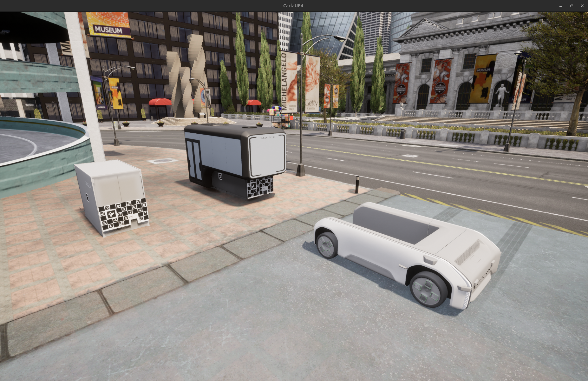
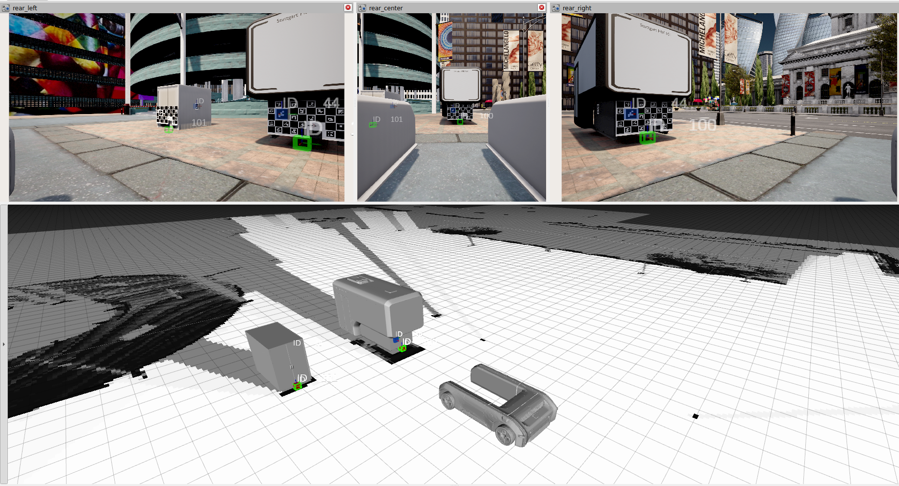

# Capsule Pose Estimation

This repository contains the software used for the capsule pose estimation of capsules within the U-Shift II Project.
Images of the final event with photos of the capsules can be found here https://www.uni-ulm.de/in/mrm/aktuell-bereich/article/final-event-u-shift-ii/

**Authors**: Oliver Schumann, Dominik Authaler \
Copyright 2026, Institute of Measurement Control and Microtechnology, Ulm University \
**License**: Apache License Version 2.0

**Disclaimer** \
This repository is published but is currently dependent on several modules that are not published.
Therefore, this repository cannot be used as a plug-and-play detector. 
Its current use is limitted to being an inspiration for users with similar use-cases.

**Overview**

<p float="left">
  
  
</p>

**Functionality** \
This repository contains the software used in the U-Shift II Project to detect capsules or containers.
The repository can be divided into three main ROS2-nodes defined in camera_detection.cpp, lidar_refinement.cpp and target_detection.cpp

- **camera_detection.cpp** \
The used capsules are marked with large ArUco markers on the sides and the front and one large ChArUco board on the front.
The large ArUco markers are used mainly for identification of the capsules and coarse pose estimation.
This is done by open source OpenCV functions. However, these detections are further refined by the lidar_refinement node.
While approaching the capsule, the mentioned ChArUco-Board on the front of the capsule is visible to the robot. 
Then, the very precise pose of the ChArUco board can also be estimated by open source OpenCV functions. 
A subsequent refinement is not necessary in this case.
The files denoting an exemplary parametrization of these functions are located under ```config/params.yaml``` and ```config/medium_board.yaml```


- **lidar_refinement.cpp** \
The rather coarse marker detections of the single ArUco markers must be further refined to allow a precise pose estimation.
They lack precise depth information and their angle can be flipped along the ray from the camera to the marker. 
Hence, they are further refined by executing a RANSAC within the points of the point cloud of an adjoint Lidar.
The RANSAC is only executed on the points lying in the uncertainty ellipse of the camera-only marker detection, which
is estimated by the markers distance and the camera properties. This RANSAC estimates a plane, that is intersected with the 
ray connecting the marker with the camera origin. 
The intersection point provides a more precise estimate of the markers pose.


- **target_detection.cpp** \
This nodes purpose is to map the marker positions to the origin of the capsule. 
Hence, the location of the markers relative to the capsule origin must be measured. 
An exemplary calibration file is located under ```config/capsules.yaml```

This method is further explained and visualized in the following paper https://doi.org/10.4271/2025-01-0281

